# Maya Architecture

Version: 0.1 (Author Intent Draft)

---

# Introduction

Maya is a frontend web framework designed around the belief that the web platform is already powerful enough to build the majority of modern applications without requiring the complexity introduced by most contemporary frontend ecosystems.

Maya exists because modern frontend development has increasingly shifted toward:

- SPA-first architectures
- server-side rendering infrastructure
- hydration complexity
- cloud-compute dependency
- large framework runtimes
- complex deployment pipelines

While these approaches solve legitimate problems, they also introduce substantial operational, architectural, and cognitive overhead.

Maya explores a different path.

The framework attempts to preserve the simplicity and deployability of traditional web applications while providing modern capabilities such as:

- componentization
- reactivity
- state management
- application structure
- developer tooling
- offline capabilities
- progressive enhancement

---

# Core Philosophy

Maya is built around several beliefs.

## The Web Platform Is Already Powerful

HTML, CSS and JavaScript have evolved significantly.

Many applications can be built successfully using native browser capabilities without introducing heavy abstraction layers.

Maya attempts to leverage browser capabilities rather than replace them.

---

## Complexity Should Be Optional

Modern frontend ecosystems frequently require developers to understand:

- hydration
- SSR
- CSR
- routing systems
- bundlers
- deployment infrastructure
- rendering lifecycles

before shipping meaningful applications.

Maya attempts to reduce this burden.

---

## Infrastructure Matters

A framework should not only optimize developer experience.

It should also optimize deployment cost, operational complexity and long-term maintainability.

One of Maya's primary goals is enabling applications to be hosted entirely from:

- static web servers
- CDNs
- GitHub Pages
- object storage platforms

without requiring application servers whenever possible.

---

## MPA First, Not SPA First

Most modern frameworks start with the assumption that every application is an SPA.

Maya does not.

Maya treats the Multi-Page Application model as a first-class architectural choice.

The framework assumes that many applications benefit more from:

- independent page ownership
- static deployment
- simpler navigation models
- predictable loading behavior

than from SPA complexity.

This does not imply that rich client-side interactivity is unavailable.

It means interactivity is layered onto pages rather than pages being layered onto a client-side application runtime.

---

# What Maya Is Not

Maya should not be viewed as:

- another React clone
- another Vue clone
- another Angular clone
- another Virtual DOM framework

Maya is attempting to solve a different problem.

The primary comparison is not:

```text
React vs Maya
```

The primary comparison is:

```text
Plain HTML/CSS/JS
        vs
Modern Frontend Frameworks
```

Maya attempts to occupy the middle ground.

---

# High Level Architecture

At a high level Maya consists of:

```text
Application Source
        ↓
Brahma Build Pipeline
        ↓
Generated Static Assets
        ↓
Browser
        ↓
Maya Runtime
        ↓
Reactive Updates
```

---

# The Maya Lifecycle

Maya applications can be understood through three major phases.

```text
Build
   ↓
Mount
   ↓
Run
```

---

## Build Phase

During the build phase:

- application source is processed
- assets are prepared
- pages are generated
- deployment artifacts are produced

This phase is primarily owned by Brahma.

The output should remain highly deployable and infrastructure-friendly.

---

## Mount Phase

The mount phase initializes the application.

Responsibilities include:

- page initialization
- component initialization
- state initialization
- event registration
- reactive graph creation

After mounting, the application becomes interactive.

---

## Run Phase

The run phase represents the active lifetime of the application.

Responsibilities include:

- user interaction
- state mutation
- reactive updates
- DOM synchronization

This is where Maya's reactive architecture becomes important.

---

# Reactive Architecture

A foundational design goal of Maya is avoiding Virtual DOM based rendering.

Instead of repeatedly rebuilding UI trees and diffing them against previous trees, Maya favors direct and targeted updates.

Conceptually:

```text
State Change
      ↓
Dependency Resolution
      ↓
Affected Nodes
      ↓
DOM Update
```

rather than:

```text
State Change
      ↓
Render Entire Tree
      ↓
Create New VDOM
      ↓
Diff
      ↓
Patch DOM
```

The goal is to perform the minimum work necessary for a change.

---

# Signals

Signals are a foundational primitive within the Maya ecosystem.

Signals provide:

- reactive state
- dependency tracking
- update propagation

The broader Maya ecosystem includes dedicated supporting libraries around these concepts.

Examples include:

- Signal
- ImmutJS
- KVDB

These libraries support Maya's broader vision of highly reactive, offline-capable web applications.

---

# Mutable UI Philosophy

Maya does not treat mutability as inherently problematic.

Many modern frameworks optimize around immutable rendering models.

Maya instead embraces direct interaction with the DOM when appropriate.

The framework is architecturally closer to browser reality than to an abstract UI tree.

This allows updates to remain:

- explicit
- targeted
- efficient

while still benefiting from reactive abstractions.

---

# Relationship Between Maya And Brahma

Maya and Brahma should be viewed as parts of the same ecosystem.

They have different responsibilities.

---

## Maya

Maya owns:

- runtime behavior
- reactivity
- rendering
- component model
- application execution

---

## Brahma

Brahma owns:

- project creation
- application scaffolding
- build pipeline
- compilation workflow
- developer tooling
- deployment workflow

Conceptually:

```text
Maya
    =
Runtime

Brahma
    =
Toolchain
```

---

# Deployment Philosophy

One of Maya's most important goals is reducing infrastructure requirements.

Applications should be capable of running from:

- static hosting
- CDN networks
- GitHub Pages
- object storage providers

without requiring dedicated compute infrastructure whenever practical.

This philosophy has several intended benefits:

- lower operational cost
- simpler deployment
- easier scaling
- fewer moving parts
- improved resilience

For many classes of applications, the desired outcome is:

```text
Developer
     ↓
Build
     ↓
Upload Static Files
     ↓
Global Availability
```

without introducing server infrastructure.

---

# Offline First Thinking

Maya is designed with Progressive Web Applications in mind.

The ecosystem encourages:

- browser-native storage
- offline capabilities
- client-side persistence
- static deployment

This aligns with the broader goal of reducing backend dependency where possible.

---

# Performance Goals

Performance is an architectural concern rather than an afterthought.

Maya aims to achieve:

- minimal rendering work
- minimal runtime overhead
- targeted DOM updates
- efficient reactivity
- fast startup characteristics

Performance should emerge naturally from the architecture rather than from aggressive optimization layers.

---

# Target Applications

Maya is particularly suited for:

- business applications
- dashboards
- productivity tools
- PWAs
- offline-capable applications
- content-heavy websites
- static-hosted applications

Examples include:

- habit trackers
- calculators
- editors
- administrative portals
- internal business tools

---

# Architectural Tradeoffs

Maya intentionally prioritizes:

- simplicity
- deployability
- maintainability
- browser alignment
- infrastructure reduction

over:

- SPA purity
- framework abstraction depth
- server-centric architectures

These tradeoffs are intentional.

---

# Long-Term Vision

The long-term vision of Maya is to provide a complete frontend ecosystem that enables developers to build modern applications while remaining close to web standards.

The framework should allow teams to benefit from:

- modern developer experience
- reactive programming
- structured applications
- rich client capabilities

without requiring the operational complexity commonly associated with modern frontend stacks.

Maya's goal is not to replace every existing frontend framework.

Its goal is to provide a simpler architectural path for developers whose applications do not benefit from that complexity.

---

# Status

This document describes architectural intent.

Implementation details may evolve.

When implementation and architecture disagree:

Architecture should be treated as the source of truth.

---

# Expansion Notes

The text above is preserved from the architecture draft and remains the philosophical source of truth. The sections below expand that intent with implementation details, source mapping, examples, diagrams, and architecture-versus-implementation validation.

Important repository note: at the time of this expansion, `ARCHITECTURE.md` did not exist in the working tree. `ARCHITECTURE_v0.md` contained the architecture draft and was used as the preserved source text for this enhanced document. `ARCHITECTURE_v0.md` was not modified.

---

# Audience And Use

This document is intended to serve four roles at once:

- onboarding guide for humans
- contributor guide for implementation work
- AI handover guide for future agents
- architectural source of truth for resolving implementation disagreement

When this document conflicts with code, the conflict should be recorded rather than silently resolved by changing the architecture. Code may evolve toward the architecture, but the architecture should not be weakened merely to describe the current implementation.

---

# System Overview

## Architectural Intent

Maya is a small runtime and Brahma is the build and development toolchain. Together they allow application authors to write structured, reactive web applications that produce static assets and run in browsers without requiring server compute.

## Why It Exists

The split lets runtime code stay focused on browser behavior while the toolchain owns file generation, project scaffolding, local development, and production packaging. This separation supports the central philosophy that static deployment and browser-native capability should remain first-class.

## Design Tradeoffs

Maya accepts a tighter coupling to browser APIs and generated static files in exchange for avoiding a large universal rendering system. Brahma accepts a convention-driven build process in exchange for simpler application structure and predictable deployment artifacts.

## Current Implementation

The repository currently contains two packages:

- `maya`: runtime exports, element creation, components, DOM wiring, custom elements, lifecycle phase tracking, and a small query helper.
- `brahma`: CLI, application probes, Karma configuration scaffolding, build pipeline, staging server, publishing, installation/reset utilities, and production packaging.

## Relevant Source Files

- `maya/index.ts`
- `maya/core/index.ts`
- `maya/core/component.ts`
- `maya/core/elements/m.ts`
- `maya/core/dom/create-element.ts`
- `brahma/src/index.ts`
- `brahma/src/builder/build.ts`
- `brahma/src/builder/build-helpers.ts`
- `brahma/src/probes/karma/karma.ts`

## Simple Example

```ts
import { m } from "@cyftec/maya";

export default m.Html({
  children: [
    m.Head({ children: m.Title("Hello Maya") }),
    m.Body({ children: m.H1("Hello World") }),
  ],
});
```

## Realistic Example

```ts
import { signal } from "@cyftec/signal";
import { m } from "@cyftec/maya";

const selected = signal("dashboard");

export default m.Html({
  lang: "en",
  children: [
    m.Head({
      children: [
        m.Title("Operations"),
        m.Meta({
          name: "viewport",
          content: "width=device-width, initial-scale=1.0",
        }),
      ],
    }),
    m.Body({
      children: [
        m.Script({ src: "main.js", defer: true }), // mandatory to include this line
        m.Nav({
          children: [
            m.Button({
              onclick: () => (selected.value = "dashboard"),
              children: "Dashboard",
            }),
            m.Button({
              onclick: () => (selected.value = "reports"),
              children: "Reports",
            }),
          ],
        }),
        m.Main({
          children: m.Switch({
            subject: selected,
            cases: {
              dashboard: () => m.H1("Dashboard"),
              reports: () => m.H1("Reports"),
            },
          }),
        }),
      ],
    }),
  ],
});
```

## Diagram

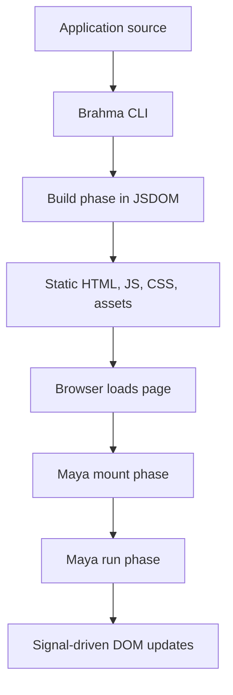

---

# Package Responsibilities

| Package          | Architectural Role           | Current Responsibility                                                           | Primary Files       |
| ---------------- | ---------------------------- | -------------------------------------------------------------------------------- | ------------------- |
| `@cyftec/maya`   | Browser runtime              | Elements, components, phase tracking, DOM updates, custom elements, query helper | `maya/**`           |
| `@cyftec/brahma` | Toolchain                    | CLI, scaffolding, build, local server, publish workflow                          | `brahma/src/**`     |
| `@cyftec/signal` | Reactive primitive           | Signals, derived signals, effects, trap helpers, async promise states            | External dependency |
| `@cyftec/immut`  | Immutable mutation detection | Array mutation analysis for keyed list rendering                                 | External dependency |
| KVDB             | Intended persistence layer   | Mentioned in architecture, not implemented in this repository                    | External ecosystem  |

---

# High-Level Architecture Expanded

## Architectural Intent

The high-level architecture should keep application code close to HTML and JavaScript while still offering component composition, reactive state, and static build output.

## Why It Exists

This shape makes the static asset pipeline the center of deployment. A page can be built once, served cheaply, mounted in the browser, and then updated directly in response to local state changes.

## Design Tradeoffs

The architecture favors static output and MPA navigation over a universal SPA router. That makes cross-page state and transitions less automatic, but it keeps page ownership, browser navigation, and cache behavior simple.

## Current Implementation

Brahma builds each page file by bundling it with Bun, executing a generated `buildPageHtml` function in a JSDOM-backed build phase, writing HTML, sanitizing the JS bundle to include `mountAndRun`, and optionally minifying production JS.

## Relevant Source Files

- `brahma/src/builder/build.ts`
- `brahma/src/builder/build-helpers.ts`
- `brahma/src/builder/build-setup.ts`
- `maya/core/dom/create-element.ts`
- `maya/utils/phase-helpers.ts`

## Simple Example

```text
dev/page.ts
    ↓
stage/index.html
stage/main.js
```

## Realistic Example

```text
dev/page.ts                       -> stage/index.html + stage/main.js
dev/about/page.ts                 -> stage/about/index.html + stage/about/main.js
dev/contacts.page.ts              -> stage/contacts.html + stage/contacts.main.js
dev/assets/styles.css             -> stage/assets/styles.css
dev/manifest.ts                   -> stage/manifest.json
```

## Diagram

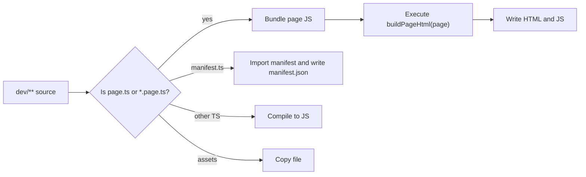

---

# Lifecycle: Build, Mount, Run

## Architectural Intent

Maya applications progress through build, mount, and run phases. Each phase has different responsibilities and different assumptions about environment and DOM ownership.

## Why It Exists

The phase model lets Maya generate static HTML before the browser sees the page, then reconnect runtime logic to that HTML, then perform direct updates after interactivity begins.

## Design Tradeoffs

The phase model requires deterministic element creation order. Element IDs are generated during build and reset during mount so the runtime can locate matching DOM nodes. This is simpler than hydration metadata systems, but it makes accidental element-order changes during mount a serious issue.

## Current Implementation

`phase.start("build")` is injected into `buildPageHtml`. `idGen.resetIdCounter()` is called before building and mounting. During build, `createElementGetter` creates real DOM nodes under JSDOM and writes `data-elem-id`. During mount, it queries existing DOM nodes by `data-elem-id`. During run, signal effects update attributes and children directly.

## Relevant Source Files

- `maya/index.types.ts`
- `maya/utils/phase-helpers.ts`
- `maya/utils/id-generator.ts`
- `maya/core/dom/create-element.ts`
- `brahma/src/builder/build-helpers.ts`

## Simple Example

```ts
// Build: creates HTML.
phase.start("build");
idGen.resetIdCounter();
page().outerHTML;

// Mount: finds generated nodes.
phase.start("mount");
idGen.resetIdCounter();
page();

// Run: subsequent signal effects update DOM.
phase.start("run");
```

## Realistic Example

```ts
export const buildPageHtml = (page) => {
  phase.start("build");
  idGen.resetIdCounter();
  const htmlPageNode = page();
  return htmlPageNode?.outerHTML;
};

const mountAndRun = () => {
  phase.start("mount");
  idGen.resetIdCounter();
  page_default();
  phase.start("run");
};
```

## Diagram

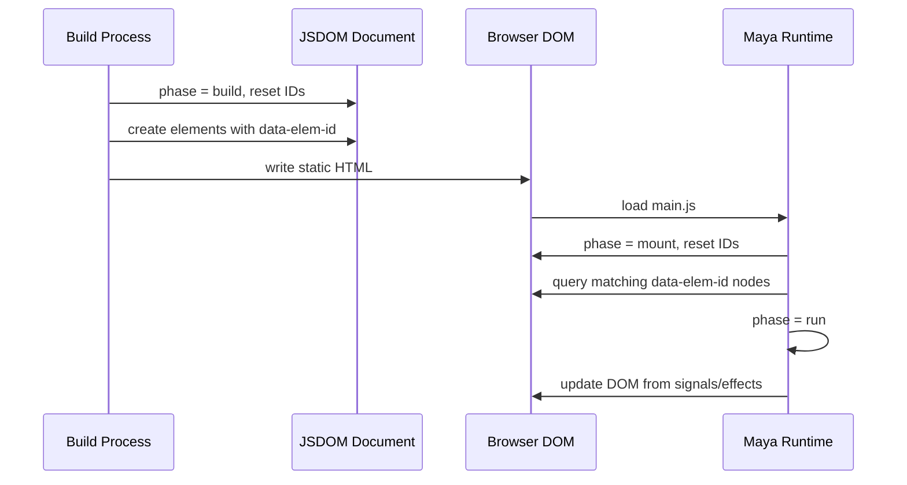

---

# Elements And Rendering

## Architectural Intent

Elements should look like HTML, map to platform tags, and produce actual DOM nodes instead of virtual nodes.

## Why It Exists

The architecture wants developers to reason about browser behavior directly. A Maya element getter is a function that returns an `MHtmlElement`, and the runtime wires attributes, events, and children onto real nodes.

## Design Tradeoffs

Direct DOM updates reduce abstraction overhead but require careful lifecycle handling. Maya must track effects, remove build-only markers, and dispose effects when nodes leave the document.

## Current Implementation

`m` is generated from `htmlTagNames`, capitalizing each HTML tag name into functions such as `m.Div`, `m.Button`, and `m.Script`. Custom elements `m.If`, `m.For`, and `m.Switch` are added to the same namespace.

## Relevant Source Files

- `maya/core/elements/m.ts`
- `maya/core/dom/create-element.ts`
- `maya/utils/constants.ts`
- `maya/index.types.ts`

## Simple Example

```ts
import { m } from "@cyftec/maya";

const heading = m.H1("Hello World");
```

## Realistic Example

```ts
const Toolbar = () =>
  m.Header({
    class: "toolbar",
    children: [
      m.A({ href: "/", children: "Home" }),
      m.Span(" | "),
      m.A({ href: "/reports", children: "Reports" }),
    ],
  });
```

## Diagram

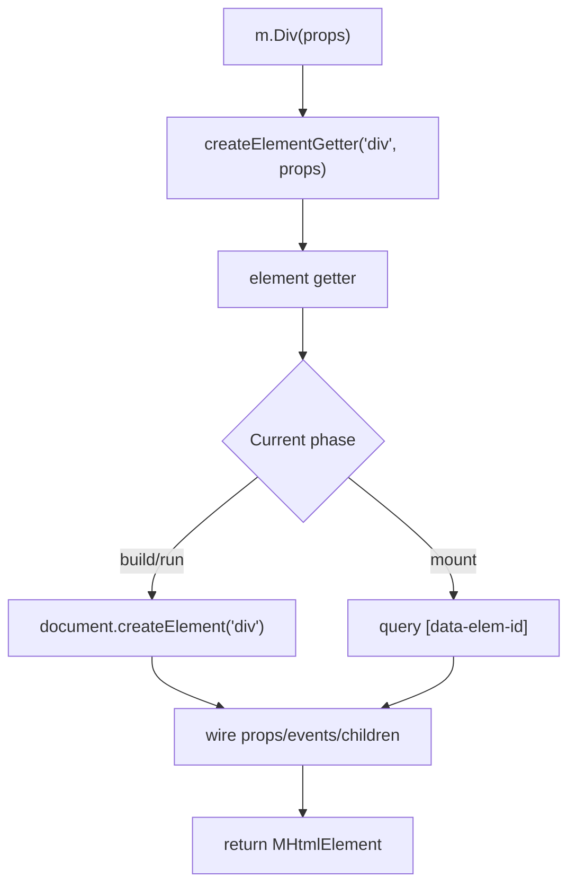

---

# Components

## Architectural Intent

Components should be plain functions that compose element getters while preserving signal awareness in props.

## Why It Exists

This avoids class lifecycles and framework-specific component instances. A component remains a reusable function that returns a Maya element getter.

## Design Tradeoffs

The current component helper transforms most non-function props into non-signal objects for internal use. This keeps component internals signal-friendly, but authors need to understand when they receive `.value` versus plain values.

## Current Implementation

`component` accepts an inner component function and returns a public component function. It removes undefined props, passes through signals and functions, unwraps some values, and converts objects to non-signal representations with `getNonSignalObject`.

## Relevant Source Files

- `maya/core/component.ts`
- `maya/index.types.ts`
- `brahma/src/probes/apps/web/@elements/button.ts`

## Simple Example

```ts
import { component, m } from "@cyftec/maya";

type Props = { label: string };

export const Label = component<Props>(({ label }) =>
  m.Span({ children: label.value }),
);
```

## Realistic Example

```ts
import { Child, component, m } from "@cyftec/maya";
import { tmpl } from "@cyftec/signal";

type ButtonProps = {
  classNames?: string;
  color?: string;
  label: Child;
  onTap: () => void;
};

export const Button = component<ButtonProps>(
  ({ classNames, color, label, onTap }) =>
    m.Button({
      class: tmpl`pa2 b ${() => color?.value || "bg-green white"} ${classNames}`,
      onclick: onTap,
      children: label,
    }),
);
```

## Diagram

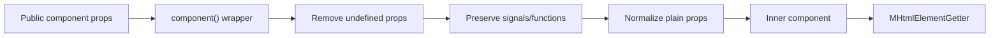

---

# Nested Components

## Architectural Intent

Nested components should be natural child values. Component composition should not require a separate rendering DSL or JSX transform.

## Why It Exists

Maya wants componentization without taking developers away from the browser's tree model.

## Design Tradeoffs

Nested component order matters because element IDs are generated in creation order. Conditional or environment-dependent tree changes during mount can break build-to-mount matching.

## Current Implementation

Children can be strings, undefined, element getters, arrays of children, signals of children, and non-signal wrappers. The runtime validates children and converts getters to DOM nodes through `getElementFromChild`.

## Relevant Source Files

- `maya/index.types.ts`
- `maya/core/dom/create-element.ts`
- `maya/utils/type-checkers.ts`
- `brahma/src/probes/apps/web/@elements/header.ts`

## Simple Example

```ts
const Header = () => m.Header({ children: m.H1("Maya") });

export default m.Html({
  children: m.Body({ children: Header() }),
});
```

## Realistic Example

```ts
const Layout = (content) =>
  m.Body({
    children: [
      Header(),
      m.Main({ children: content }),
      m.Footer("Static footer"),
    ],
  });

export default m.Html({
  children: [
    m.Head({ children: m.Title("Nested Components") }),
    Layout(m.Section({ children: "Dashboard content" })),
  ],
});
```

## Diagram

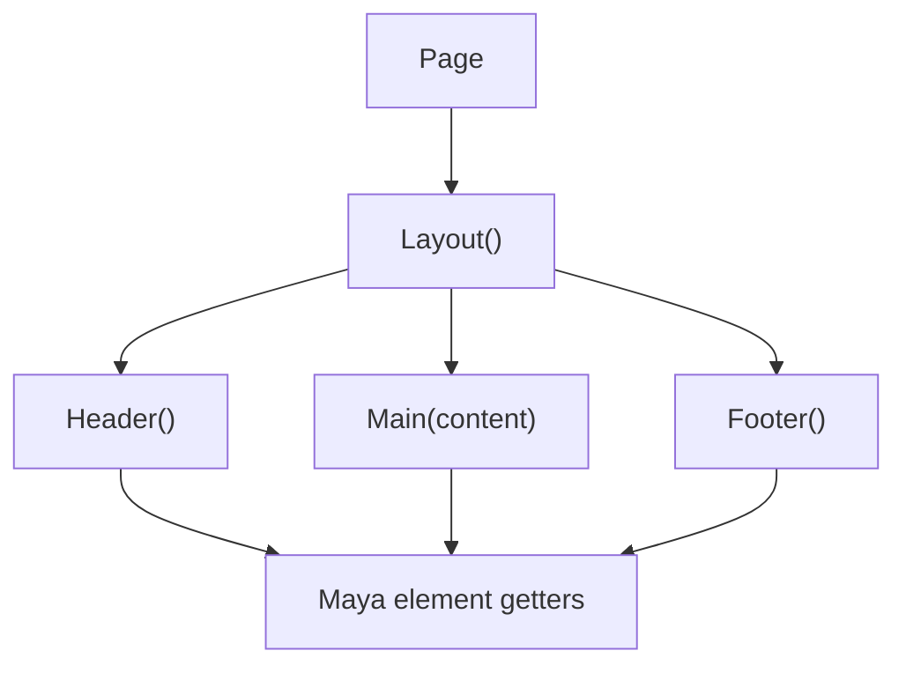

---

# State Management

## Architectural Intent

State should be reactive, local-first, and small enough to compose without a mandatory global store.

## Why It Exists

Maya targets pages that can own their own behavior. Signals provide direct update propagation without rendering a whole component tree.

## Design Tradeoffs

Signals are explicit and efficient, but global application state, persistence policies, and cross-page synchronization are not yet formalized in this repository.

## Current Implementation

The runtime depends on `@cyftec/signal`. Examples use `signal`, `derive`, `effect`, `tmpl`, `trap`, and `promstates`. Maya itself does not implement a separate store abstraction.

## Relevant Source Files

- `maya/package.json`
- `maya/core/dom/create-element.ts`
- `maya/core/elements/custom-elements/if.ts`
- `maya/core/elements/custom-elements/for.ts`
- `maya/toolkit/query.ts`
- `brahma/src/probes/apps/web/page.ts`

## Simple Example

```ts
import { signal } from "@cyftec/signal";

const count = signal(0);
count.value += 1;
```

## Realistic Example

```ts
import { derive, signal } from "@cyftec/signal";
import { m } from "@cyftec/maya";

const todos = signal([{ id: 1, text: "Write architecture", done: false }]);

const remaining = derive(() => todos.value.filter((todo) => !todo.done).length);

const App = () =>
  m.Main({
    children: [
      m.H1({ children: remaining }),
      m.For({
        subject: todos,
        itemKey: "id",
        map: (todo) => m.Label({ children: todo.value.text }),
      }),
    ],
  });
```

## Diagram

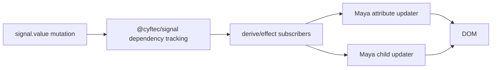

---

# Signals And Effects

## Architectural Intent

Signals represent reactive values. Effects represent work that should re-run when observed signal dependencies change.

## Why It Exists

Signals allow targeted DOM changes without reconstructing the full UI tree.

## Design Tradeoffs

Effects must be disposed when DOM nodes are removed. Maya therefore attaches `effects` to `MHtmlElement` and disposes them via unmount listeners.

## Current Implementation

Signal attributes are collected in `handleAttributeProps`; an `effect` re-applies their sanitized values during the run phase. Signal children are similarly updated by effects. `onunmount` starts a `MutationObserver` and calls subtree unmount listeners.

## Relevant Source Files

- `maya/core/dom/create-element.ts`
- `maya/core/dom/unmount-observer.ts`
- `maya/index.types.ts`

## Simple Example

```ts
import { effect, signal } from "@cyftec/signal";

const name = signal("Maya");
effect(() => console.log(name.value));
name.value = "Brahma";
```

## Realistic Example

```ts
const status = signal("idle");

m.Button({
  class: status,
  onclick: () => (status.value = "busy"),
  children: status,
});
```

## Diagram

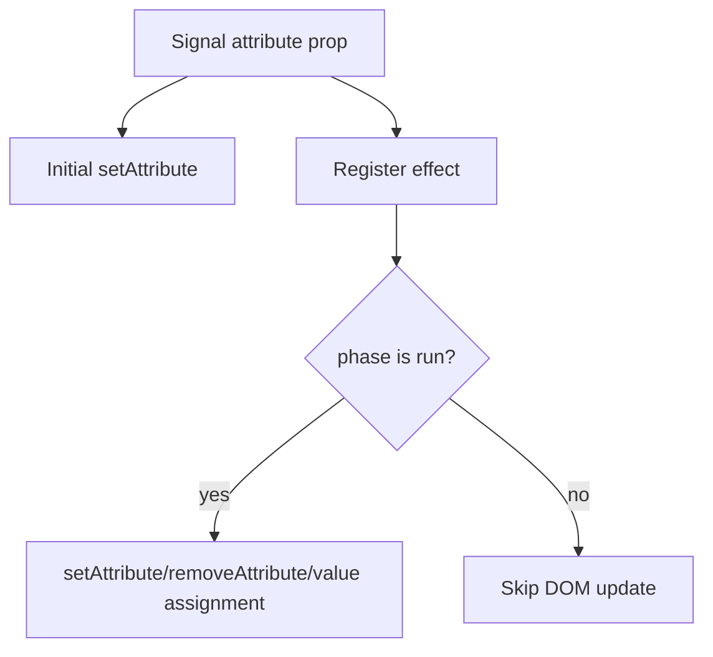

---

# DOM Updates

## Architectural Intent

DOM updates should be precise, direct, and proportional to the change.

## Why It Exists

This follows the mutable UI philosophy and avoids Virtual DOM diffing.

## Design Tradeoffs

Direct node replacement is simple, but signal child updates currently replace child nodes at specific indexes. Keyed list rendering reduces unnecessary replacement for list items, but general child replacement remains direct rather than diffed.

## Current Implementation

`setAttribute` sanitizes and writes attributes. For boolean attributes it sets or removes the attribute. For `value`, it assigns to the element property. `setChild` replaces or appends a child at a position and removes excess children when signal children shrink.

## Relevant Source Files

- `maya/core/dom/create-element.ts`
- `maya/utils/sanitizers.ts`
- `maya/utils/decoders.ts`

## Simple Example

```ts
const label = signal("Save");

m.Button({
  children: label,
});

label.value = "Saved";
```

## Realistic Example

```ts
const formState = signal({ disabled: false, value: "" });

m.Input({
  value: derive(() => formState.value.value),
  disabled: derive(() => formState.value.disabled),
  oninput: (event) => {
    const input = event.target as HTMLInputElement;
    formState.value = { ...formState.value, value: input.value };
  },
});
```

## Diagram

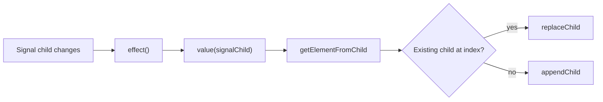

---

# Conditional Rendering

## Architectural Intent

Conditional rendering should be declarative while still resolving to direct DOM children.

## Why It Exists

Applications need view branching without a client-side router or component lifecycle machinery.

## Design Tradeoffs

The hidden fallback element (`display: none`) keeps return types stable but introduces a placeholder node when no visible branch exists.

## Current Implementation

`m.If` evaluates `subject` through `value`. When the subject is a signal, it returns a derived signal of the selected child. Otherwise it returns the child immediately.

## Relevant Source Files

- `maya/core/elements/custom-elements/if.ts`

## Simple Example

```ts
const loggedIn = signal(false);

m.If({
  subject: loggedIn,
  isTruthy: () => m.Span("Signed in"),
  isFalsy: () => m.A({ href: "/login", children: "Sign in" }),
});
```

## Realistic Example

```ts
const user = signal<{ name: string } | undefined>(undefined);

m.Section({
  children: m.If({
    subject: user,
    isTruthy: (currentUser) => m.H1(`Welcome ${currentUser.value.name}`),
    isFalsy: () => m.Form({ children: LoginFields() }),
  }),
});
```

## Diagram

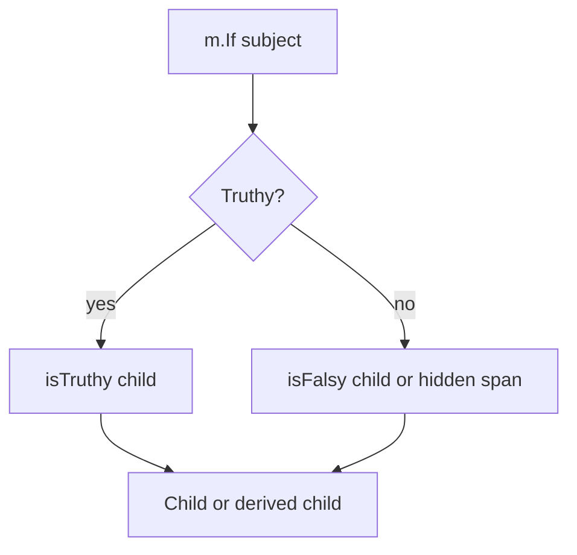

---

# List Rendering

## Architectural Intent

Lists should support simple mapping and keyed mutation-aware rendering.

## Why It Exists

Real applications need repeated views. Mutable keyed lists help preserve DOM nodes and local DOM state when item data changes.

## Design Tradeoffs

Simple lists are easy but may recreate children when the list changes. Keyed mutable lists require object items and a stable `itemKey`, but they can update existing mapped children using item and index signals.

## Current Implementation

`m.For` maps non-signal arrays directly. Signal arrays without `itemKey` return a derived list. Signal arrays with `itemKey` use `getArrayMutations` from `@cyftec/immut`, keep `itemSignal` and `indexSignal` per mapped child, and preserve existing child getters where possible.

## Relevant Source Files

- `maya/core/elements/custom-elements/for.ts`
- `maya/package.json`

## Simple Example

```ts
m.Ul({
  children: m.For({
    subject: ["A", "B", "C"],
    map: (item) => m.Li(item),
  }),
});
```

## Realistic Example

```ts
const tasks = signal([
  { id: 1, text: "Design", done: false },
  { id: 2, text: "Build", done: false },
]);

m.Ul({
  children: m.For({
    subject: tasks,
    itemKey: "id",
    map: (task, index) =>
      m.Li({
        children: [
          m.Input({
            type: "checkbox",
            checked: derive(() => task.value.done),
            onchange: () => {
              tasks.value = tasks.value.map((item) =>
                item.id === task.value.id
                  ? { ...item, done: !item.done }
                  : item,
              );
            },
          }),
          m.Span({
            children: derive(() => `${index.value + 1}. ${task.value.text}`),
          }),
        ],
      }),
  }),
});
```

## Diagram

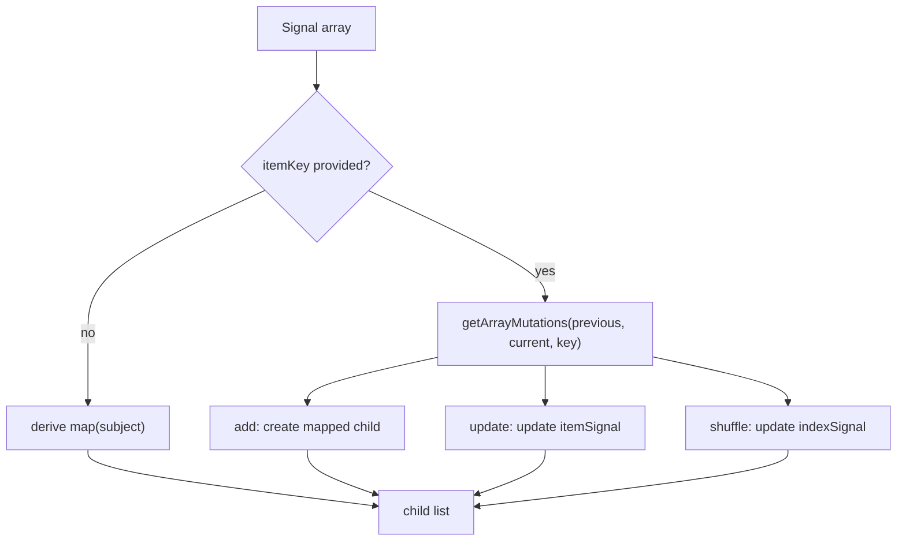

---

# Events

## Architectural Intent

Events should use native DOM event names and simple handler functions.

## Why It Exists

This keeps the framework aligned with browser semantics and avoids inventing a separate synthetic event system.

## Design Tradeoffs

Native event wiring is simple, but there is no centralized event delegation layer. Many handlers mean many DOM listeners.

## Current Implementation

Maya recognizes HTML event props from `htmlEventKeys` and custom event props `onmount` and `onunmount`. HTML event names are sliced from `onclick` to `click`, then registered with `addEventListener`.

## Relevant Source Files

- `maya/utils/constants.ts`
- `maya/core/dom/create-element.ts`
- `maya/core/dom/unmount-observer.ts`

## Simple Example

```ts
m.Button({
  onclick: () => console.log("clicked"),
  children: "Click",
});
```

## Realistic Example

```ts
m.Div({
  onmount: (element) => {
    element.dataset.ready = "true";
  },
  onunmount: (element) => {
    console.log("Disposed", element.elementId);
  },
  children: m.Button({
    onclick: () => submitForm(),
    children: "Submit",
  }),
});
```

## Diagram

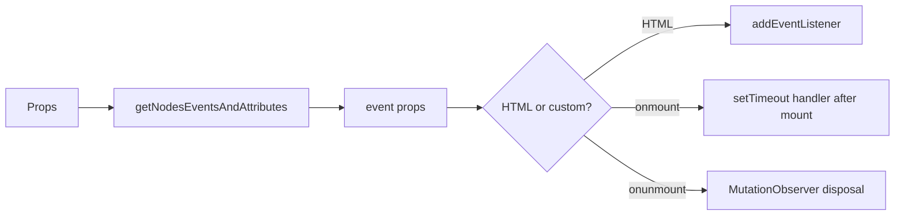

---

# Forms

## Architectural Intent

Forms should be ordinary HTML forms and inputs, enhanced by signals where useful.

## Why It Exists

The browser already provides form controls, validation attributes, and submission behavior. Maya should layer reactivity onto those controls rather than replacing them.

## Design Tradeoffs

Maya currently gives `value` special handling by assigning to the element property, which works for inputs but does not yet provide a full form abstraction.

## Current Implementation

Forms are represented by `m.Form`, `m.Input`, `m.Textarea`, `m.Select`, and related native tags. Event handlers such as `oninput`, `onchange`, and `onsubmit` are native listeners.

## Relevant Source Files

- `maya/utils/constants.ts`
- `maya/core/dom/create-element.ts`
- `maya/index.types.ts`

## Simple Example

```ts
const name = signal("");

m.Input({
  value: name,
  oninput: (event) => {
    name.value = (event.target as HTMLInputElement).value;
  },
});
```

## Realistic Example

```ts
const draft = signal({ title: "", body: "" });

m.Form({
  onsubmit: (event) => {
    event.preventDefault();
    saveDraft(draft.value);
  },
  children: [
    m.Input({
      name: "title",
      value: derive(() => draft.value.title),
      oninput: (event) => {
        draft.value = {
          ...draft.value,
          title: (event.target as HTMLInputElement).value,
        };
      },
    }),
    m.Textarea({
      name: "body",
      oninput: (event) => {
        draft.value = {
          ...draft.value,
          body: (event.target as HTMLTextAreaElement).value,
        };
      },
      children: derive(() => draft.value.body),
    }),
    m.Button({ type: "submit", children: "Save" }),
  ],
});
```

## Diagram

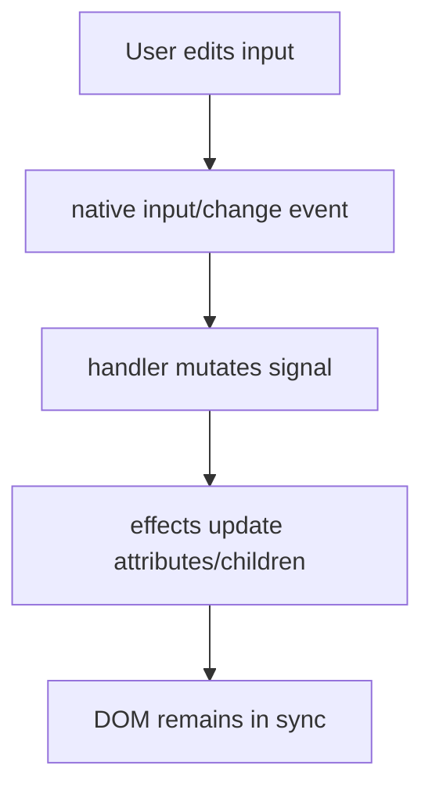

---

# Routing

## Architectural Intent

Routing should be MPA-first. Pages should be independently buildable and navigable through normal URLs.

## Why It Exists

Browser navigation, static hosting, CDN caching, and page ownership are simpler when the file system determines routes.

## Design Tradeoffs

MPA routing gives up SPA-style client route transitions by default. Cross-page state must be persisted or encoded in URL/storage rather than held in a single in-memory app shell.

## Current Implementation

Brahma identifies buildable page files by `config.brahma.build.buildablePageFileName`, defaulting to `page.ts`. Dotted file names such as `contacts.page.ts` produce named HTML files such as `contacts.html`. Folder-based `page.ts` files produce nested `index.html` files.

## Relevant Source Files

- `brahma/src/builder/build-helpers.ts`
- `brahma/src/builder/build.ts`
- `brahma/src/probes/apps/web/page.ts`
- `brahma/src/probes/apps/web/about/page.ts`
- `brahma/src/probes/apps/web/contacts.page.ts`

## Simple Example

```text
dev/page.ts         -> /
dev/about/page.ts   -> /about/
dev/help.page.ts    -> /help.html
```

## Realistic Example

```ts
const Header = () =>
  m.Nav({
    children: [
      m.A({ href: "/", children: "Home" }),
      m.A({ href: "/about", children: "About" }),
      m.A({ href: "/contacts.html", children: "Contacts" }),
    ],
  });
```

## Diagram

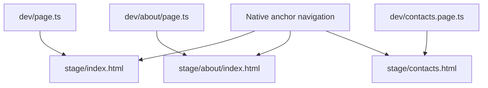

---

# Async Operations

## Architectural Intent

Async operations should fit into the signal model and remain optional. Fetching should not require server rendering infrastructure.

## Why It Exists

Static-hosted applications still need network calls. Maya should allow pages to render immediately and then update as browser-side async operations complete.

## Design Tradeoffs

The toolkit currently provides a minimal query helper rather than a comprehensive cache, mutation, retry, or stale-while-revalidate system.

## Current Implementation

`maya/toolkit/query.ts` creates a signal state object with `isLoading`, `data`, and `error`. It uses `promstates` and an `AbortController`, exposes `runQuery`, `abortQuery`, and `clearCache`, and parses JSON responses into state.

## Relevant Source Files

- `maya/toolkit/query.ts`
- `maya/toolkit/index.ts`

## Simple Example

```ts
import { query } from "@cyftec/maya/toolkit";

const users = query<User[]>("/api/users", undefined);
users.runQuery();
```

## Realistic Example

```ts
const report = query<{ total: number }>("/api/report", undefined);

m.Section({
  onmount: () => report.runQuery(),
  onunmount: () => report.abortQuery(),
  children: [
    m.If({
      subject: report.isLoading,
      isTruthy: () => m.P("Loading"),
    }),
    m.If({
      subject: report.data,
      isTruthy: (data) => m.Strong(`Total: ${data.value.total}`),
      isFalsy: () =>
        m.Button({ onclick: report.runQuery, children: "Load report" }),
    }),
  ],
});
```

## Diagram

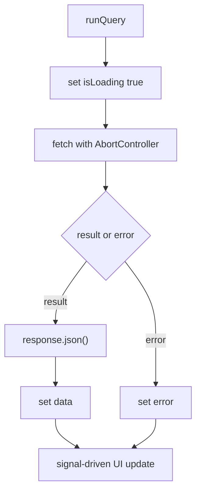

---

# Persistence And Offline Support

## Architectural Intent

Persistence and offline support should use browser-native storage and PWA capabilities, reducing backend dependency where possible.

## Why It Exists

Offline-capable static applications can provide resilience, lower operating cost, and useful behavior even without continuous network access.

## Design Tradeoffs

The architecture mentions KVDB as part of the broader ecosystem, but this repository does not currently include an implementation. PWA scaffolding exists, but the service worker probe is minimal.

## Current Implementation

Brahma can scaffold a PWA probe. The PWA probe includes a `manifest.ts`, service worker registration in `app.ts`, image assets, and `sw.ts`. The current `sw.ts` only logs `"service-worker"` and does not implement caching strategies.

## Relevant Source Files

- `brahma/src/probes/apps/pwa/app.ts`
- `brahma/src/probes/apps/pwa/sw.ts`
- `brahma/src/probes/apps/pwa/manifest.ts`
- `brahma/src/probes/apps/pwa/assets/**`

## Simple Example

```ts
if (navigator && "serviceWorker" in navigator) {
  navigator.serviceWorker.register("/sw.js");
}
```

## Realistic Example

```ts
const notes = signal(JSON.parse(localStorage.getItem("notes") || "[]"));

effect(() => {
  localStorage.setItem("notes", JSON.stringify(notes.value));
});
```

## Diagram

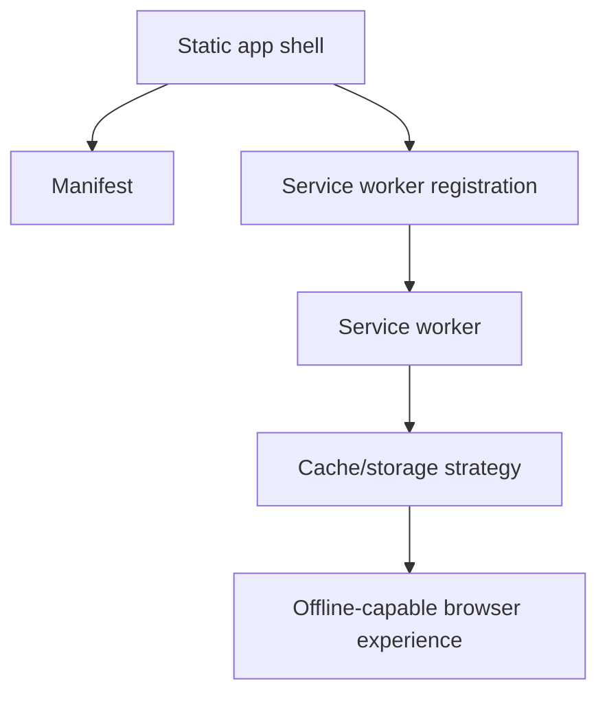

---

# Build Process

## Architectural Intent

The build process should produce deployable static artifacts from application source.

## Why It Exists

Static output supports the infrastructure goals: CDN/object storage hosting, GitHub Pages, simple uploads, and no application server requirement.

## Design Tradeoffs

Brahma currently uses Bun APIs and JSDOM. This simplifies toolchain implementation but makes Bun a central requirement for the CLI and build path.

## Current Implementation

`buildApp` calls `setupBuild`, resolves the Maya app source path from Karma config, recursively builds directories, deletes stale destination directories, handles page files specially, compiles TS files, writes manifest JSON, copies assets, and zips extension production output.

## Relevant Source Files

- `brahma/src/builder/build.ts`
- `brahma/src/builder/build-helpers.ts`
- `brahma/src/builder/build-setup.ts`
- `brahma/src/utils/zip-the-folder.ts`
- `brahma/src/probes/karma/karma.ts`

## Simple Example

```text
brahma stage
```

## Realistic Example

```text
brahma publish

Input:
  dev/page.ts
  dev/assets/styles.css
  dev/manifest.ts

Output:
  prod/index.html
  prod/main.js
  prod/assets/styles.css
  prod/manifest.json
```

## Diagram

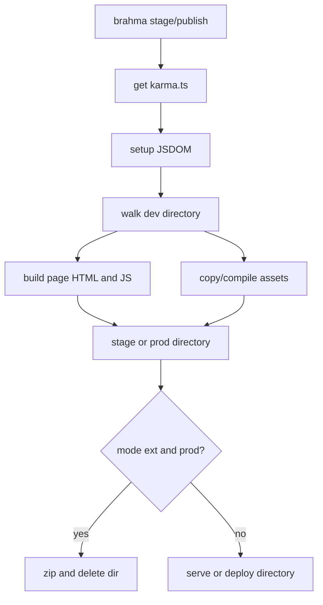

---

# Deployment

## Architectural Intent

Deployment should usually mean uploading static files.

## Why It Exists

This keeps hosting cost, scaling complexity, and operational requirements low.

## Design Tradeoffs

Static deployment is excellent for browser-run applications, but applications needing server-only secrets, server-side personalization, or dynamic SSR must integrate external services.

## Current Implementation

`brahma publish` writes production artifacts to the configured publish directory, defaulting to `prod`. If build mode is `ext`, it zips the production directory.

## Relevant Source Files

- `brahma/src/commands/publish.ts`
- `brahma/src/builder/build.ts`
- `brahma/src/builder/build-helpers.ts`
- `brahma/src/probes/karma/karma.ts`

## Simple Example

```text
brahma publish
upload ./prod to static hosting
```

## Realistic Example

```text
1. Run brahma publish.
2. Upload prod/** to a CDN-backed bucket.
3. Configure fallback only if host-specific clean URL behavior requires it.
4. Serve generated HTML, JS, CSS, assets, and manifest files directly.
```

## Diagram

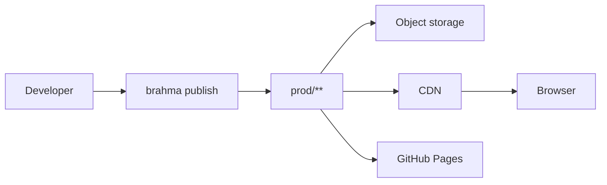

---

# PWA Features

## Architectural Intent

PWA support should be a first-class extension of the static deployment model.

## Why It Exists

Progressive Web Apps allow static-hosted applications to behave more like installed, offline-capable applications.

## Design Tradeoffs

PWA support introduces browser-specific lifecycle concerns such as service worker install, activate, caching, and update behavior. Maya's architecture supports this direction, but current probes are intentionally minimal.

## Current Implementation

`brahma create <name> --pwa` copies the PWA probe into the app source. The probe includes manifest assets, a manifest object compiled to `manifest.json`, a service worker registration script, and a service worker source file.

## Relevant Source Files

- `brahma/src/commands/create.ts`
- `brahma/src/probes/apps/pwa/**`
- `brahma/src/builder/build.ts`

## Simple Example

```text
brahma create my-app --pwa
```

## Realistic Example

```ts
const manifest = {
  short_name: "My PWA",
  name: "My First PWA",
  icons: [
    { src: "/assets/images/192_logo.png", sizes: "192x192", type: "image/png" },
    { src: "/assets/images/512_logo.png", sizes: "512x512", type: "image/png" },
  ],
  start_url: ".",
  display: "standalone",
  theme_color: "#000000",
  background_color: "#ffffff",
};

export default manifest;
```

## Diagram

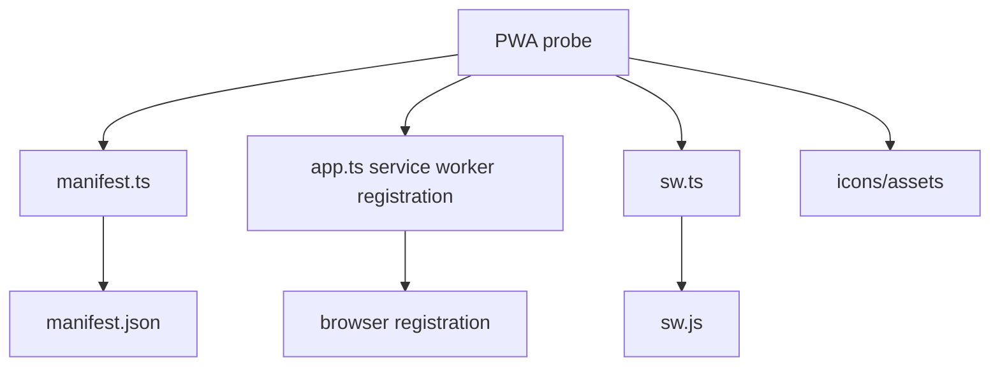

---

# Security And Sanitization

## Architectural Intent

Maya should remain close to browser APIs without ignoring common browser security hazards.

## Why It Exists

Direct DOM attribute setting is powerful, but unsafe URL and style values can introduce script execution or data exfiltration risks.

## Design Tradeoffs

Current sanitization is small and targeted. It blocks dangerous `href` and `style` values, but it is not a full HTML sanitizer and does not sanitize all possible attribute contexts.

## Current Implementation

`sanitizeAttributeValue` checks `href` and `style`. It decodes HTML entities, URI encoding, and JavaScript unicode escapes before testing dangerous protocol and CSS patterns.

## Relevant Source Files

- `maya/utils/sanitizers.ts`
- `maya/utils/decoders.ts`
- `maya/core/dom/create-element.ts`

## Simple Example

```ts
m.A({ href: "/docs", children: "Docs" });
```

## Realistic Example

```ts
// Throws because javascript: URLs are blocked for href.
m.A({
  href: "javascript:alert(1)",
  children: "Unsafe",
});
```

## Diagram

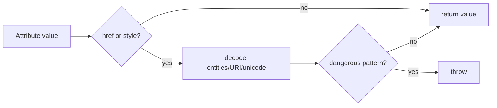

---

# Large Project Structure

## Architectural Intent

Large Maya projects should remain understandable through page ownership, local components, shared components, assets, and generated output separation.

## Why It Exists

MPA-first architecture works best when directories express route ownership and shared code is explicit.

## Design Tradeoffs

Convention-driven layout reduces configuration, but contributors must follow naming rules such as `page.ts` for index (html) page
in a directory (route), `*.page.ts` for file-based page e.g. about.page.ts -> about.html, `@`-prefixed directories gets ignored by brahma during build phase (for efficient buuild), and configured source/build directories.

## Current Implementation

Brahma probes use `dev` as the source directory, `stage` for development output, `prod` for production output, `@elements` for local shared elements, and `@components` for nested feature components. Files or directories beginning with the ignore delimiter `@` are skipped by the build walker when producing output, so shared source folders do not become route folders.

## Relevant Source Files

- `brahma/src/probes/karma/karma.ts`
- `brahma/src/builder/build.ts`
- `brahma/src/probes/apps/web/**`

## Simple Example

For plain static website, view can be directly placed inside root (dev/) directory

```text
dev/
  page.ts
  about/
    page.ts
  @elements/
    header.ts
```

## Realistic Example

For complex apps, follow MVC structure, and update `karma.ts` config file to tell brahma about where is the actual view/ directory
inside the root (dev/) directory

```text
dev/
  controller/...
  models/...
  view/
    page.ts
    contacts.page.ts
    manifest.ts
    assets/
      styles.css
    @elements/
      header.ts
      button.ts
    living-room/
      page.ts
      @components/
        bulb.ts
        photo-frame.ts
      sample-assets/
        styles.css
```

## Diagram

```mermaid
flowchart TD
  A["dev/"] --> B["page.ts route"]
  A --> C["feature/page.ts route"]
  A --> D["*.page.ts named page"]
  A --> E["@elements ignored source-only"]
  A --> F["assets copied"]
  B --> G["stage/prod output"]
  C --> G
  D --> G
  F --> G
```

---

# Source Mapping

## Runtime

Files:

- `maya/index.ts`
- `maya/core/index.ts`
- `maya/core/component.ts`
- `maya/core/elements/**`
- `maya/core/dom/**`
- `maya/index.types.ts`
- `maya/utils/**`

Responsibilities:

- expose public runtime API
- create element getters
- map HTML tags to `m.*` functions
- support components
- wire attributes, children, events, effects, and unmount listeners
- track lifecycle phase
- validate child and prop shapes
- sanitize selected attributes

Dependencies:

- `@cyftec/signal`
- `@cyftec/immut`
- browser DOM APIs
- `MutationObserver`

## Element Factory

Files:

- `maya/core/elements/m.ts`
- `maya/core/dom/create-element.ts`
- `maya/utils/constants.ts`

Responsibilities:

- generate Maya element constructors from HTML tag names
- return `MHtmlElementGetter` functions
- handle build/mount/run element lookup and creation
- split props into events, attributes, and children

Dependencies:

- `htmlTagNames`
- `createElementGetter`
- phase helpers
- ID generator

## Custom Elements

Files:

- `maya/core/elements/custom-elements/if.ts`
- `maya/core/elements/custom-elements/for.ts`
- `maya/core/elements/custom-elements/switch.ts`
- `maya/core/elements/custom-elements/index.ts`

Responsibilities:

- provide declarative conditional rendering
- provide list rendering
- provide switch/case rendering
- return plain children or derived signal children

Dependencies:

- `@cyftec/signal`
- `@cyftec/immut`
- `m.Span` hidden fallback

## Lifecycle And Phases

Files:

- `maya/utils/phase-helpers.ts`
- `maya/globals.d.ts`
- `maya/index.types.ts`
- `brahma/src/builder/build-helpers.ts`

Responsibilities:

- store current app phase on `window._currentAppPhase`
- expose phase checks
- inject build and mount phase transitions into generated artifacts

Dependencies:

- browser/global `window`
- Brahma generated wrapper code

## Build Toolchain

Files:

- `brahma/src/index.ts`
- `brahma/src/builder/build.ts`
- `brahma/src/builder/build-helpers.ts`
- `brahma/src/builder/build-setup.ts`
- `brahma/src/commands/stage.ts`
- `brahma/src/commands/publish.ts`

Responsibilities:

- parse CLI commands
- validate Maya app directories
- build pages and assets
- create static output
- run development server
- build production artifacts

Dependencies:

- Bun
- JSDOM
- live-server
- Karma config

## Scaffolding And Configuration

Files:

- `brahma/src/commands/create.ts`
- `brahma/src/probes/karma/karma.ts`
- `brahma/src/probes/karma/karma-types.ts`
- `brahma/src/probes/apps/**`
- `brahma/src/utils/karma-file-updaters.ts`

Responsibilities:

- create new app directories
- copy web, PWA, and extension probes
- maintain generated app config
- define source/output naming conventions

Dependencies:

- Node file system APIs
- path resolution
- package dependency constants

## Async Toolkit

Files:

- `maya/toolkit/query.ts`
- `maya/toolkit/index.ts`

Responsibilities:

- expose browser fetch helper
- track loading/data/error with signals
- support abort and cache clearing

Dependencies:

- `fetch`
- `AbortController`
- `@cyftec/signal`

## PWA And Offline

Files:

- `brahma/src/probes/apps/pwa/app.ts`
- `brahma/src/probes/apps/pwa/sw.ts`
- `brahma/src/probes/apps/pwa/manifest.ts`
- `brahma/src/probes/apps/pwa/assets/**`

Responsibilities:

- register service worker
- define web app manifest
- provide starter assets

Dependencies:

- browser service worker API
- manifest schema package in generated app dependency set

---

# Architecture Vs Implementation

| Subsystem               | Intended Architecture                                               | Current Implementation                                                    | Alignment Status  | Notes                                                                     |
| ----------------------- | ------------------------------------------------------------------- | ------------------------------------------------------------------------- | ----------------- | ------------------------------------------------------------------------- |
| Project vision          | Browser-native, low-complexity, static-friendly framework           | Repository contains runtime and CLI packages supporting this direction    | Aligned           | README is minimal; architecture document is the main expression of vision |
| MPA-first routing       | MPA is first-class, interactivity layered onto pages                | File-system page build creates static HTML and JS per page                | Aligned           | No SPA router exists, which is consistent with current intent             |
| Build phase             | Source processed into deployable static assets                      | Brahma uses Bun and JSDOM to emit HTML/JS/assets                          | Aligned           | Strong dependency on Bun should be treated as toolchain choice            |
| Mount phase             | Runtime initializes page, components, state, events, reactive graph | Generated `mountAndRun` calls page function after resetting IDs           | Mostly aligned    | Matching depends on deterministic element creation                        |
| Run phase               | User interaction, state mutation, reactive DOM synchronization      | Effects update attributes and children only when phase is `run`           | Aligned           | Effect disposal depends on unmount observation                            |
| Rendering model         | Avoid Virtual DOM, update affected nodes directly                   | Direct DOM creation, replacement, attribute updates                       | Aligned           | Child replacement is index-based except keyed `For` behavior              |
| Signals                 | Signals are foundational state primitive                            | External `@cyftec/signal` is used throughout runtime                      | Aligned           | Signal library source is external to this repo                            |
| Effects                 | Reactive effects propagate updates                                  | Attribute and child effects are registered on DOM elements                | Aligned           | Disposal exists through unmount listeners                                 |
| Components              | Plain functions compose UI                                          | `component` helper normalizes props and returns element getters           | Aligned           | Prop normalization behavior should be documented for users                |
| Conditional rendering   | Declarative conditional UI                                          | `m.If` returns child or derived child, with hidden span fallback          | Aligned           | Placeholder fallback is an implementation detail                          |
| List rendering          | Efficient list updates                                              | `m.For` supports simple lists and keyed mutable lists                     | Aligned           | Keyed mode requires object items                                          |
| Forms                   | Native browser forms enhanced by signals                            | Native tags and event handlers are available                              | Partially aligned | No dedicated form abstraction exists                                      |
| Events                  | Browser-native events, simple handlers                              | `addEventListener` per event prop; custom `onmount` and `onunmount`       | Aligned           | No synthetic event system                                                 |
| Async operations        | Browser-side async fits signal model                                | `query` helper wraps fetch state                                          | Partially aligned | No comprehensive cache/retry/mutation system                              |
| Persistence             | Browser-native storage and KVDB ecosystem                           | No persistence module in this repo                                        | Gap               | Architecture mentions KVDB; implementation is external or future          |
| Offline support         | PWA/offline capable applications                                    | PWA probe registers service worker, but service worker has no cache logic | Partial/gap       | Starter exists, offline behavior not implemented                          |
| Deployment              | Static files deployable to CDN/object storage/GitHub Pages          | `publish` writes `prod`, extension mode zips output                       | Aligned           | Deployment upload is outside CLI                                          |
| Security                | Stay close to DOM while guarding dangerous values                   | Sanitizes `href` and `style` only                                         | Partial           | Broader sanitization policy is not implemented                            |
| Large project structure | Structured apps with page ownership                                 | Probes show `dev`, `@elements`, feature folders, assets                   | Aligned           | More guidance needed for shared state and persistence                     |

---

# Required Example Catalog

## Hello World

```ts
import { m } from "@cyftec/maya";

export default m.Html({
  children: [
    m.Head({ children: m.Title("Hello") }),
    m.Body({
      children: [
        m.Script({ src: "main.js", defer: true }),
        m.H1("Hello World"),
      ],
    }),
  ],
});
```

## Application Bootstrap

```ts
// Generated by Brahma around each page bundle.
const mountAndRun = () => {
  phase.start("mount");
  idGen.resetIdCounter();
  page_default();
  phase.start("run");
};

mountAndRun();
```

## Components

```ts
const Card = (title: string, body: string) =>
  m.Article({
    class: "card",
    children: [m.H2(title), m.P(body)],
  });
```

## Nested Components

```ts
const Sidebar = () => m.Aside("Navigation");
const Shell = (content) => m.Body({ children: [Sidebar(), m.Main(content)] });
```

## State Management

```ts
const count = signal(0);
const doubled = derive(() => count.value * 2);
```

## Signals

```ts
m.Output({ children: derive(() => `Count: ${count.value}`) });
```

## Effects

```ts
effect(() => {
  console.log("count changed", count.value);
});
```

## Rendering

```ts
m.Div({
  id: "root",
  children: [m.H1("Rendered by Maya"), m.P("Real DOM, no VDOM")],
});
```

## DOM Updates

```ts
const disabled = signal(false);

m.Button({
  disabled,
  onclick: () => (disabled.value = true),
  children: "Submit",
});
```

## Conditional Rendering

```ts
m.If({
  subject: disabled,
  isTruthy: () => m.Span("Submitting"),
  isFalsy: () => m.Span("Ready"),
});
```

## List Rendering

```ts
m.For({
  subject: ["One", "Two"],
  map: (item) => m.Li(item),
});
```

## Forms

```ts
const email = signal("");

m.Form({
  onsubmit: (event) => event.preventDefault(),
  children: [
    m.Input({
      type: "email",
      value: email,
      oninput: (event) =>
        (email.value = (event.target as HTMLInputElement).value),
    }),
    m.Button({ type: "submit", children: "Join" }),
  ],
});
```

## Events

```ts
m.Button({
  onclick: () => console.log("clicked"),
  onmount: (element) => console.log("mounted", element.elementId),
  children: "Click",
});
```

## Routing

```text
dev/page.ts          -> /
dev/about/page.ts    -> /about/
dev/docs.page.ts     -> /docs.html
```

## Async Operations

```ts
const profile = query<{ name: string }>("/api/profile", undefined);

m.Section({
  onmount: profile.runQuery,
  children: m.If({
    subject: profile.data,
    isTruthy: (data) => m.H1(data.value.name),
    isFalsy: () => m.Button({ onclick: profile.runQuery, children: "Load" }),
  }),
});
```

## Persistence

```ts
const settings = signal(JSON.parse(localStorage.getItem("settings") || "{}"));

effect(() => {
  localStorage.setItem("settings", JSON.stringify(settings.value));
});
```

## Offline Support

```ts
if ("serviceWorker" in navigator) {
  navigator.serviceWorker.register("/sw.js");
}
```

## Build Process

```text
brahma stage     # build stage/** and serve locally
brahma publish   # build prod/** for deployment
```

## Deployment

```text
brahma publish
upload prod/** to static hosting
```

## PWA Features

```ts
export default {
  name: "Maya PWA",
  short_name: "Maya",
  start_url: ".",
  display: "standalone",
  icons: [
    { src: "/assets/images/192_logo.png", sizes: "192x192", type: "image/png" },
  ],
};
```

## Large Project Structure

```text
dev/
  page.ts
  about/
    page.ts
  reports/
    page.ts
    @components/
      report-table.ts
  @elements/
    header.ts
    button.ts
  assets/
    styles.css
```

---

# Contributor Guidance

## Preserve The Philosophy

Contributors should not make Maya more SPA-first, server-first, or Virtual-DOM-centric merely because those patterns are common elsewhere. If a feature requires those patterns, document the pressure and decide explicitly whether the architecture should evolve.

## Prefer Browser-Native Semantics

Before adding a framework abstraction, ask whether HTML, CSS, JavaScript, DOM APIs, service workers, storage APIs, or static hosting conventions already solve the problem.

## Keep Build Output Deployable

Generated output should remain understandable static assets. A feature that requires always-on application servers conflicts with the deployment philosophy unless it is clearly optional.

## Document Discrepancies

When code disagrees with this document, update `ARCHITECTURE_REVIEW.md` or a similar review artifact with:

- intended architecture
- current implementation
- alignment status
- migration notes

Do not silently weaken this architecture document to match implementation gaps.

---

# AI Agent Handover Notes

Future AI agents should treat this document as the primary architectural guide. Before changing implementation, inspect source files and compare the desired change against these principles:

- MPA first
- static deployment first
- browser APIs first
- signals for targeted reactivity
- direct DOM updates instead of Virtual DOM
- Maya owns runtime, Brahma owns toolchain
- implementation gaps should be documented, not used to erase intent

High-risk areas for agents:

- changing element creation order can break build/mount matching
- adding client router behavior can undermine MPA-first architecture
- hiding build-time browser access errors can obscure the build/mount/run boundary
- replacing direct DOM updates with full-tree rerendering conflicts with the reactive architecture
- treating PWA probes as complete offline support is inaccurate

---

# Open Implementation Gaps

| Gap                                        | Architectural Area     | Current State                              | Suggested Direction                                                                     |
| ------------------------------------------ | ---------------------- | ------------------------------------------ | --------------------------------------------------------------------------------------- |
| Missing persistence package in repo        | Offline-first thinking | KVDB is mentioned but not implemented here | Document external KVDB integration or add official persistence toolkit                  |
| Minimal service worker                     | PWA/offline support    | `sw.ts` only logs                          | Add cache/install/fetch examples when offline strategy is defined                       |
| No form abstraction                        | Forms                  | Native forms only                          | Keep native-first; add helper only if it reduces repetitive signal wiring               |
| Limited sanitization                       | Security               | `href` and `style` only                    | Define threat model before expanding                                                    |
| No test suite visible in repo              | Contributor confidence | No tests found during source inspection    | Add focused tests around build output, phase behavior, element updates, and keyed lists |
| `ARCHITECTURE.md` missing before this task | Documentation          | Only `ARCHITECTURE_v0.md` existed          | This file now carries the expanded source of truth                                      |

---

# Final Status

This document preserves the original architectural intent and expands it with current implementation details. The implementation is broadly aligned with the architecture in runtime model, build pipeline, MPA routing, and static deployment. The main discrepancies are incomplete persistence/offline implementation, minimal PWA service worker behavior, limited security policy, and absence of a dedicated form/state persistence layer in this repository.
